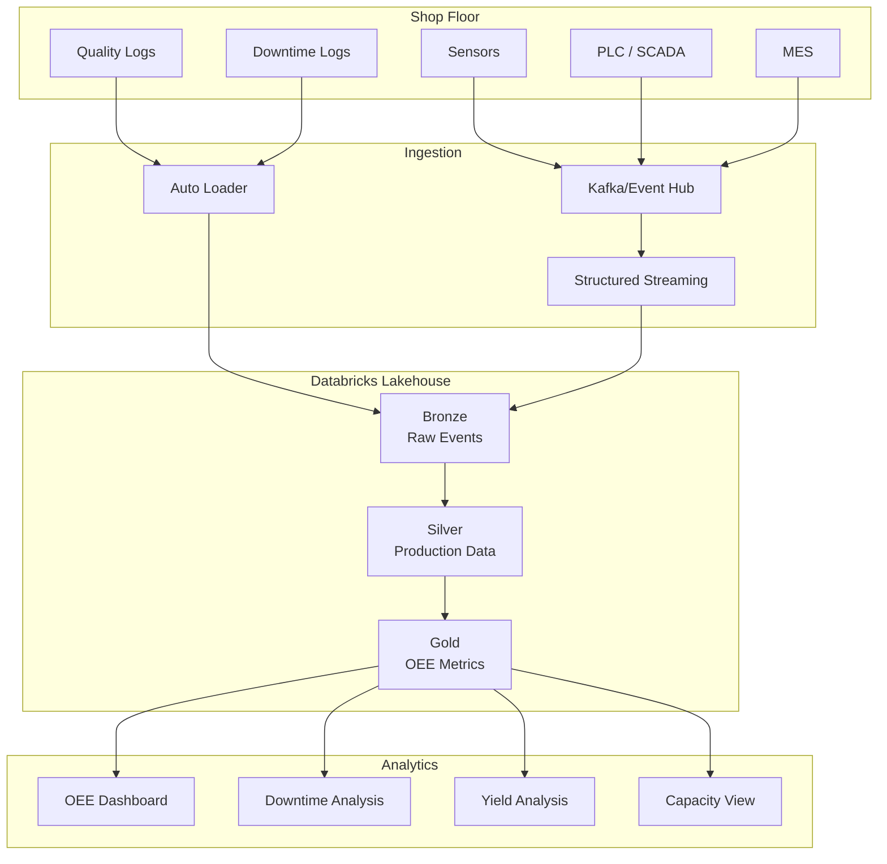

# OEE-Analytics

```mermaid
flowchart TB

    subgraph ShopFloor["Shop Floor"]
        Sensors["Sensors"]
        PLC["PLC / SCADA"]
        MES["MES"]
        Quality["Quality Logs"]
        Downtime["Downtime Logs"]
    end

    subgraph Ingestion["Ingestion"]
        EventHub["Kafka/Event Hub"]
        AutoLoader["Auto Loader"]
        Streaming["Structured Streaming"]
    end

    subgraph Lakehouse["Databricks Lakehouse"]
        Bronze["Bronze<br/>Raw Events"]
        Silver["Silver<br/>Production Data"]
        Gold["Gold<br/>OEE Metrics"]
    end

    subgraph Analytics["Analytics"]
        OEE["OEE Dashboard"]
        DowntimeRpt["Downtime Analysis"]
        YieldRpt["Yield Analysis"]
        CapacityRpt["Capacity View"]
    end

    Sensors --> EventHub
    PLC --> EventHub
    MES --> EventHub
    Quality --> AutoLoader
    Downtime --> AutoLoader

    EventHub --> Streaming
    AutoLoader --> Bronze
    Streaming --> Bronze

    Bronze --> Silver
    Silver --> Gold

    Gold --> OEE
    Gold --> DowntimeRpt
    Gold --> YieldRpt
    Gold --> CapacityRpt
```
