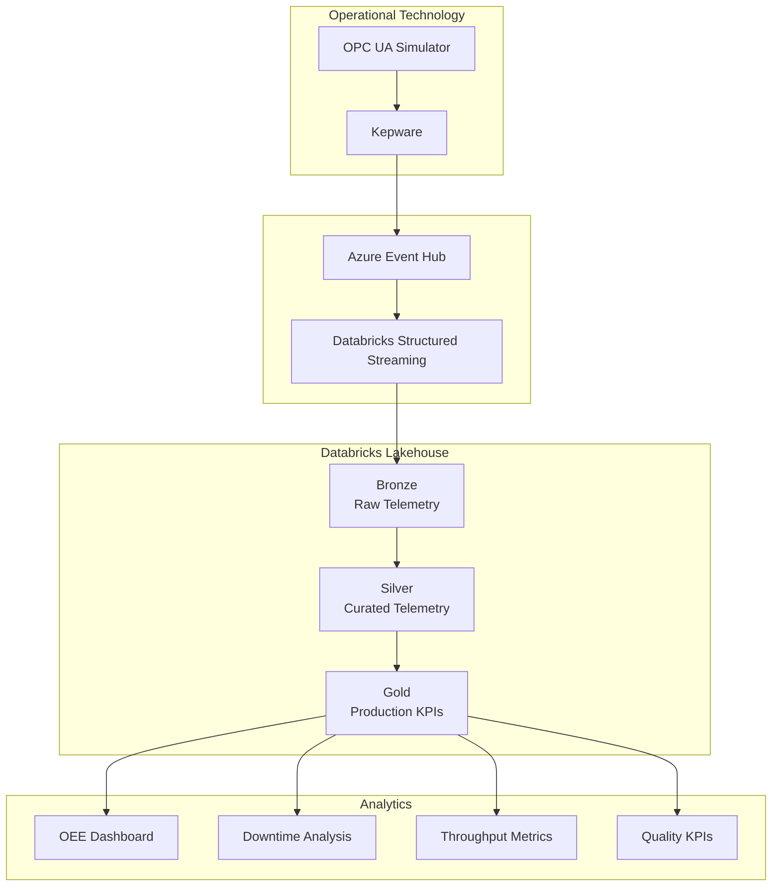

## 🚀 Smart Factory OEE Analytics

### 🛠️ Tech Stack
- Databricks, Delta Lake, Databricks SQL, Azure Event Hub

### 📌 Highlights
- Built OEE analytics pipeline using Medallion Architecture
- Calculated Availability, Performance, and Quality KPIs
- Developed Databricks SQL dashboards for production monitoring
- Automated ETL with Delta Lake
  
### 📊 Dashboard Preview

### 🏗️ Solution Architecture

