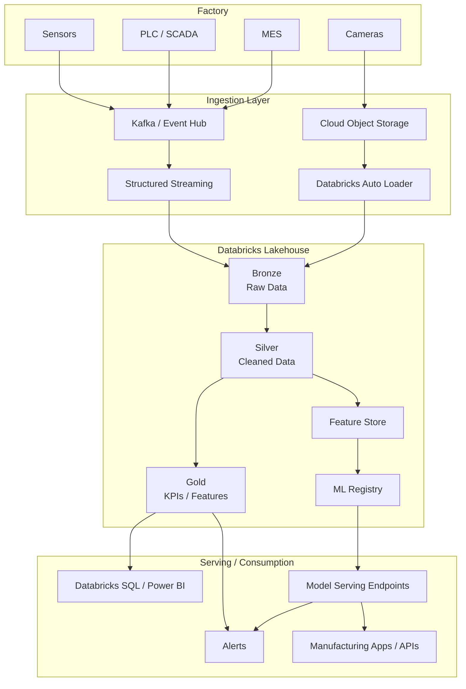

# smart-manufacturing

```mermaid
flowchart TB

    %% External factory systems
    subgraph Factory["Factory"]
        Sensors["Sensors"]
        PLC["PLC / SCADA"]
        MES["MES"]
        Cameras["Cameras"]
    end

    %% Ingestion layer
    subgraph Ingestion["Ingestion Layer"]
        Kafka["Kafka / Event Hub"]
        ObjectStorage["Cloud Object Storage"]
        AutoLoader["Databricks Auto Loader"]
        Streaming["Structured Streaming"]
    end

    %% Lakehouse layer
    subgraph Lakehouse["Databricks Lakehouse"]
        Bronze["Bronze<br/>Raw Data"]
        Silver["Silver<br/>Cleaned Data"]
        Gold["Gold<br/>KPIs / Features"]
        FeatureStore["Feature Store"]
        MLflow["ML Registry"]
    end

    %% Serving layer
    subgraph Serving["Serving / Consumption"]
        Dashboards["Databricks SQL / Power BI"]
        Alerts["Alerts"]
        ModelServing["Model Serving Endpoints"]
        Apps["Manufacturing Apps / APIs"]
    end

    Sensors --> Kafka
    PLC --> Kafka
    MES --> Kafka
    Cameras --> ObjectStorage

    Kafka --> Streaming
    ObjectStorage --> AutoLoader

    Streaming --> Bronze
    AutoLoader --> Bronze

    Bronze --> Silver
    Silver --> Gold
    Silver --> FeatureStore

    FeatureStore --> MLflow
    MLflow --> ModelServing

    Gold --> Dashboards
    Gold --> Alerts
    ModelServing --> Apps
    ModelServing --> Alerts
```
